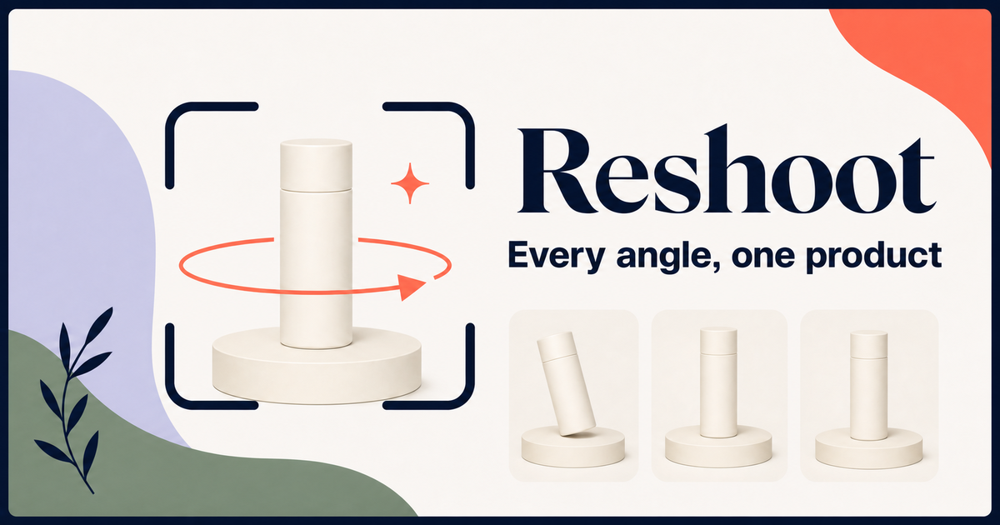
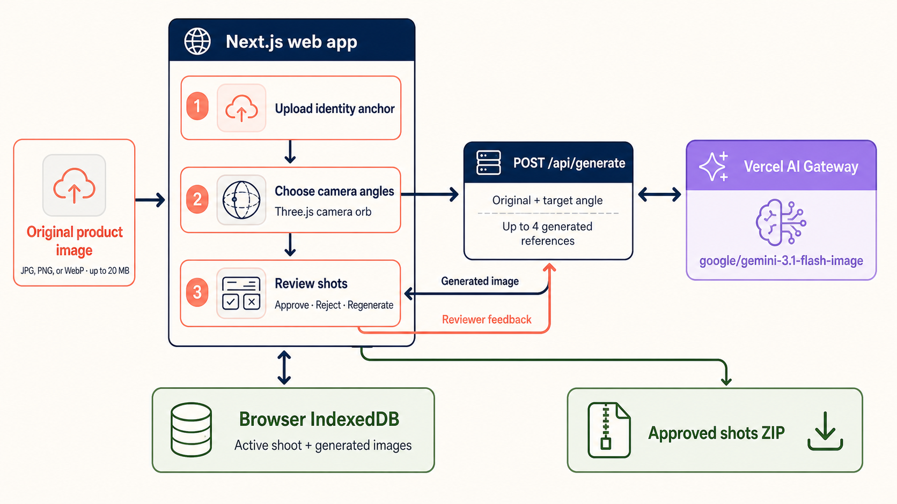

<div align="center">
  

  **📸 Every angle, one product. 📸**
</div>

Reshoot is a mobile-first web app for small brands, studios, and product teams that need a consistent set of product photos without arranging another shoot. Upload one authoritative product image, choose up to eight camera perspectives, review or regenerate the AI-created views, and download the approved shots as a ZIP.

The original image remains the identity anchor throughout the workflow. Generated views can improve spatial consistency, but they never replace the original as the source of truth.

## Install

Requirements: Node.js 24+, pnpm 10, and an authenticated Vercel CLI.

```bash
git clone https://github.com/tsilva/reshoot.git
cd reshoot
pnpm install
vercel link
vercel env pull .env.local --yes
pnpm dev
```

Open [http://localhost:3000](http://localhost:3000). You can upload a product image or use the included sample doll.

## Commands

```bash
pnpm dev        # start the local development server
pnpm build      # create a production build
pnpm start      # serve the production build
pnpm lint       # run ESLint
pnpm typecheck  # check TypeScript
```

## Notes

- Uploads accept JPG, PNG, and WebP images up to 20 MB.
- The active shoot and generated images are saved in browser IndexedDB. Starting a new shoot clears that local data.
- Generation runs through Vercel AI Gateway using `google/gemini-3.1-flash-image`. AI Gateway billing must be enabled.
- Local AI requests use the Vercel OIDC token pulled into `.env.local`; deployments receive Vercel OIDC automatically.
- The deployment target is the Vercel project `tsilvas-projects/reshoot`. The intended Cloudflare record is an A record named `reshoot` pointing to `76.76.21.21`.
- The preserved Stitch export and visual verification notes are in [`design/stitch-source`](./design/stitch-source) and [`design-qa.md`](./design-qa.md).

## Architecture



## License

No license file is currently included.
