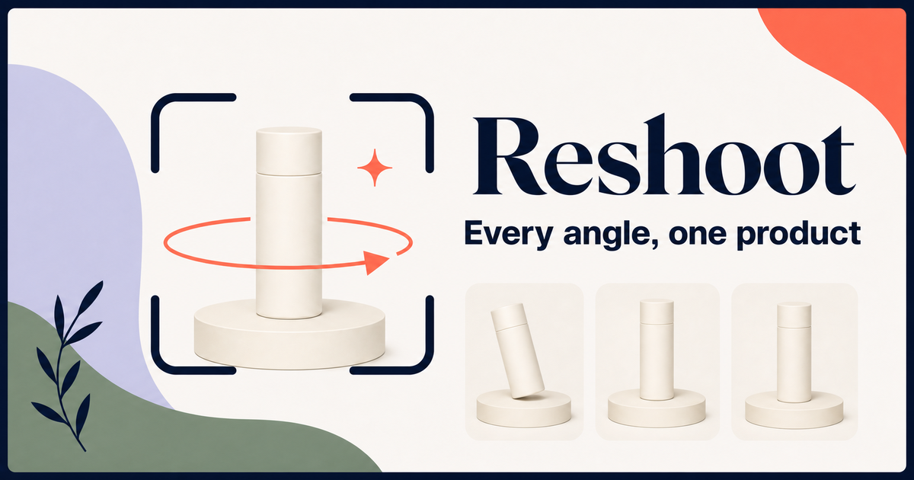

<p align="center">
  
  <br />
  <!-- repo-tagline:start -->
  <strong>📸 Every angle, one product 📸</strong>
  <!-- repo-tagline:end -->
</p>

Reshoot is a persistent product-photography workspace for small brands, studios, and product teams. Create a project for each product, upload every original photo you have, choose the views you need, and keep every generated version and approval together.

One selected original remains the primary identity anchor. Up to four additional originals can support each generation, and Reshoot shows the exact credit quote before a batch begins.

## Install

```bash
git clone https://github.com/tsilva/reshoot.git
cd reshoot
pnpm install
pnpm secrets:check
pnpm dev --port auto
```

For browser uploads and ZIP exports, the private R2 bucket's CORS policy must allow the server's printed origin, including its automatically assigned port, with `GET`, `PUT`, `HEAD`, and the `Content-Type` header. Configure this with a bucket administrator using [Cloudflare's CORS guide](https://developers.cloudflare.com/r2/buckets/cors/); application credentials only have object access. Signed URLs still control access to private files.

## Commands

```bash
pnpm dev        # start the local development server
pnpm build      # create a production build
pnpm start      # serve the production build
pnpm lint       # run ESLint
pnpm typecheck  # check TypeScript
pnpm test       # run unit and integration tests
pnpm db:migrate # apply forward database migrations
```

## Notes

- Neon stores users, projects, immutable generation history, pricing, and credit accounting.
- A private Cloudflare R2 bucket stores originals, normalized references, previews, and generated outputs. Browser uploads use short-lived signed URLs.
- Scheduled reconciliation is disabled. Users request another attempt with Regenerate after a failed generation; automatic pricing reconciliation and expired-object cleanup are also paused.
- Dependency overrides exclude Workflow's unused NestJS adapter and use tinyglobby for Next.js lint root discovery, removing two unpatched dependency chains while retaining Next.js Workflow support and lint rules.
- Uploads accept up to 25 JPG, PNG, or WebP originals per project, 20 MB each and 500 MB total.
- Testing workspaces start with 1,000 fake credits without payment. Local and preview deployments also include a clearly labeled no-charge test checkout. Production checkout remains disabled until real billing exists. Fake credits still authorize real image-service requests; generation consumes provider resources.
- The image service and model are private server configuration and are intentionally absent from public APIs, browser bundles, filenames, and customer-facing diagnostics.
- A previous browser-saved shoot is imported once into the persistent project library, then the legacy browser database is retired.
- The deployment target is the Vercel project `tsilvas-projects/reshoot` at `reshoot.tsilva.eu`.
- The preserved Stitch export and visual verification notes are in [`design/stitch-source`](./design/stitch-source) and [`design-qa.md`](./design-qa.md).

## Image generation evaluation

The current catalog-photo prompt defines camera movement, preserves product packaging and markings, and keeps lighting and framing consistent across views. Flare is the selected default; Sunburst remains a server-configured alternative. See the [model comparison and reproduction procedure](./docs/image-generation-evaluation.md). Hidden surfaces are estimates unless supporting originals show them.

## License

No license file is currently included.
