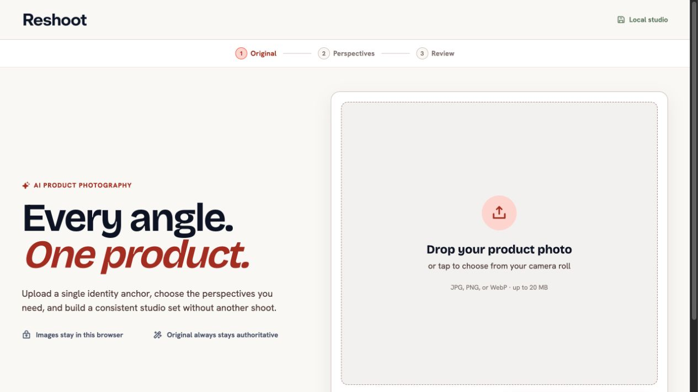
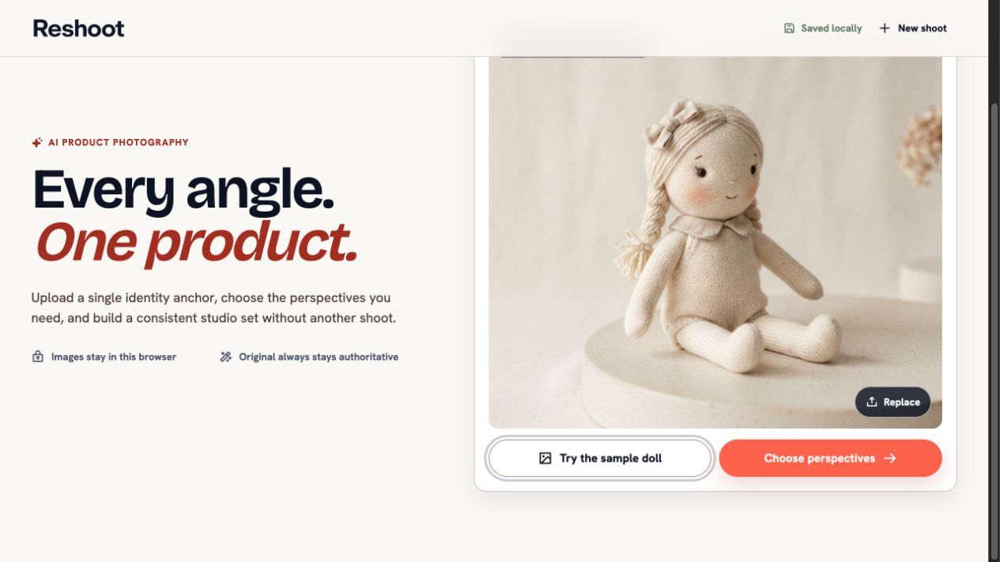
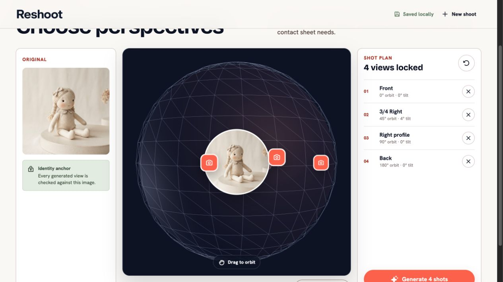
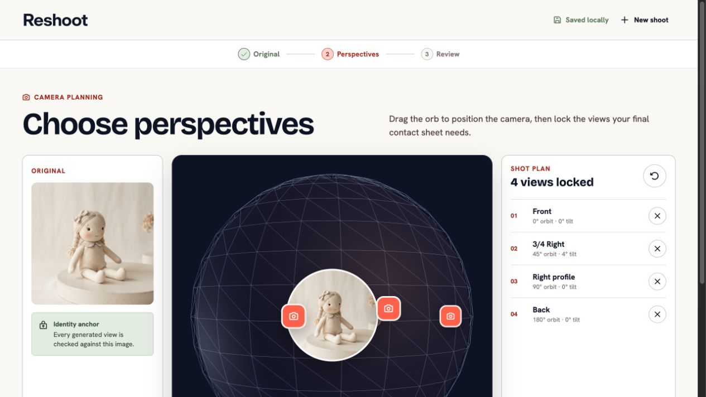
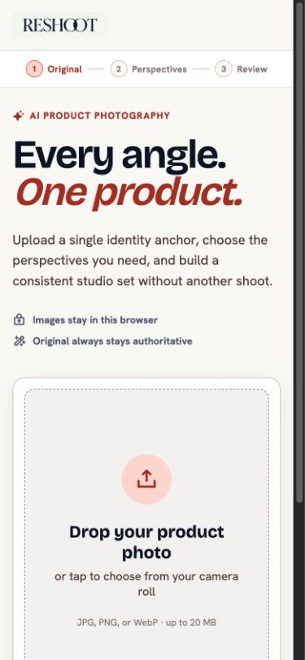
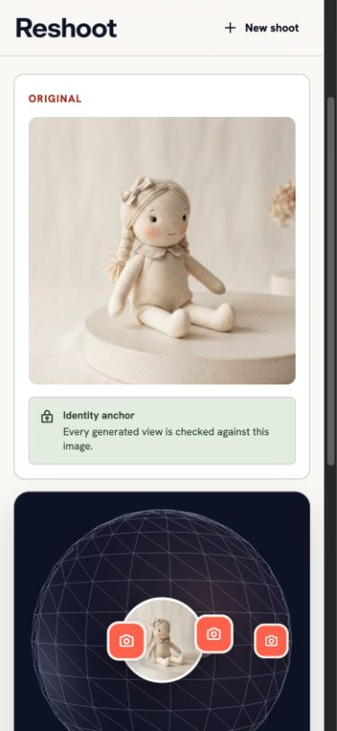
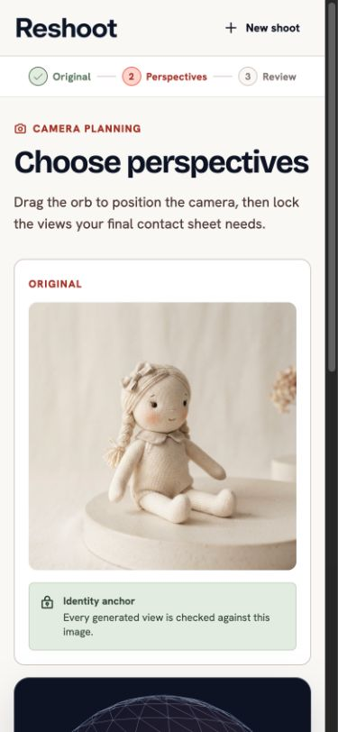

# Reshoot first-use UX audit

Date: 2026-07-30

## Audit scope

First-use flow from an empty studio through loading the sample product and
choosing perspectives, at 1280 × 720 and 390 × 844. The paid image-generation
step was not submitted, so generation, review, and export are outside the
evidence boundary of this audit.

## User goal and accessibility target

The user should be able to add one product photo, understand which views will
be generated, adjust that plan if necessary, and confidently start generation.
The flow should remain understandable with keyboard input, at a mobile
viewport, and for users who need clear state-change feedback.

## Overall verdict

The visual system feels polished, but the flow changes screens without
re-orienting the user and makes a novel 3D camera tool the default way to
complete a familiar selection task. The result is attractive but harder to
predict than it needs to be.

## Flow steps

### 1. Empty upload — needs hierarchy work

The upload target is clear and the progress rail establishes a short journey.
At 720 px high, however, the sample action and disabled next action are below
the fold. The user cannot see the complete decision set on entry.

### 2. Sample loaded — healthy, with one trust issue

The product preview, Replace action, and primary Choose perspectives action are
clear. The line “Images stay in this browser” is misleading because generation
sends the original through the server to the image service. The intended
message is local persistence, not browser-only processing.

### 3. Transition to perspectives — unhealthy

The transition preserves the previous page's scroll position. The new title is
clipped, the progress rail is gone, and the Generate action is only partly
visible. This is the strongest explanation for the experience feeling “funky”:
the screen changes underneath the user without returning them to the start of
the new task.

### 4. Perspective planning from the top — needs a simpler default

Four views are already locked, but they are not introduced as a recommended
starter set. The user is simultaneously told to drag the orb, shown four
camera pins, and given a separate Lock this view action. The pins look
interactive but do not respond. The primary Generate action remains below the
fold.

### 5. Mobile upload — needs stronger task priority

The marketing headline and trust copy consume most of the first viewport. The
upload target starts near the bottom, while the sample and next actions are
farther below. For a mobile-first product, the user's first task should arrive
earlier than the supporting story.

### 6. Mobile transition — unhealthy

Preserved scroll is more disorienting on mobile: the title, instructions, and
progress rail disappear completely. The user lands on the identity card and a
partial orb with no visible explanation of the task.

### 7. Mobile planning from the top — needs reordering

Even from the correct scroll position, the large identity card pushes the
actual perspective control below the first viewport. The original is useful
reference material, but it should be a compact strip or thumbnail on mobile,
not the first full-size work surface.

## Strengths

- The brand, spacing, and product imagery feel coherent and considered.
- Upload and Replace are familiar, legible actions.
- The sample product lowers the cost of trying the experience.
- The progress rail communicates a short three-part journey.
- Most primary touch targets are comfortably sized.

## UX risks

1. Screen changes preserve scroll position, so users can miss the new title,
   instructions, progress state, and primary action.
2. The 3D orb is a high-learning-cost control for choosing standard camera
   angles. Presets would be faster and easier to verify.
3. Four default views appear as if the user selected them, without a
   “Recommended starter set” explanation.
4. Camera pins use button semantics and look tappable, but they have no
   behavior and pointer interaction is disabled.
5. The step rail looks navigational but cannot be used to return to completed
   steps.
6. The privacy reassurance overstates local-only behavior.

## Accessibility risks

- The orb is drag-only. Its application container is not keyboard focusable and
  provides no keyboard controls or equivalent preset controls.
- Camera pins are exposed as buttons despite having no action, which gives
  assistive technology a false affordance.
- Step labels use about 3.72:1 contrast, the upload file hint about 3.54:1, and
  shot-plan metadata about 4.33:1. These small text styles fall below the 4.5:1
  target for normal text.
- A client-side step change does not move focus to the new heading or otherwise
  announce the new task.

## Recommended direction

1. Reset scroll and move focus to the new `h1` on every step change. Add
   `aria-current="step"` to the active step.
2. Make familiar presets the default: Front, 3/4 Right, Right profile, and Back,
   visibly labeled as a recommended starter set. Put the orb behind an
   “Add custom angle” action.
3. On mobile, show the perspective choices first, reduce the original to a
   compact reference strip, and keep Generate in a sticky action bar.
4. Either make camera pins real controls that select their shot, or render them
   as non-interactive markers.
5. Make completed steps navigable for backward movement.
6. Replace the trust line with precise copy such as: “Saved in this browser.
   Sent to the image service only when you generate.”
7. Raise secondary text contrast and provide a complete keyboard alternative
   for camera selection.

## Evidence limits

This audit confirms visual hierarchy, responsive layout, browser scroll
behavior, control behavior, source semantics, and source color values for the
captured first-use flow. It does not establish full WCAG compliance. Paid
generation was not submitted, so generation timing, review decisions, error
recovery, and export remain untested.
